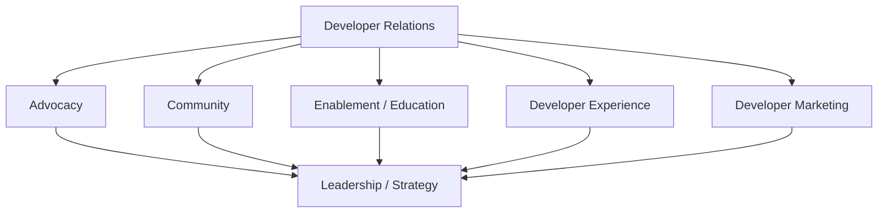

DevRel job titles are messy.

A Developer Advocate at one company might spend most of the week writing code and building demos.

At another company, the same title could mean events, content, community, and product feedback.

So do not build your career around the title alone.

Build it around the work.

## Think in pathways, not a single ladder

Developer Relations usually includes several overlapping areas:



You can move between them.

You can also become more senior without becoming a people manager.

## Developer Advocate

**You may enjoy this path if you like:**

- code;
- teaching;
- demos;
- technical writing;
- talks;
- developer conversations;
- being the bridge between users and product teams.

**Typical work:**

- build sample apps;
- write tutorials;
- speak at events;
- run workshops;
- answer technical questions;
- gather product feedback;
- support launches;
- test the developer journey.

**Evidence to build:**

- technical articles;
- repositories;
- talks;
- videos;
- workshops;
- product feedback examples;
- documentation contributions.

## Developer Experience Engineer

**You may enjoy this path if you like:**

- solving friction in tooling;
- SDKs;
- CLIs;
- APIs;
- onboarding;
- testing;
- docs systems;
- engineering work with a strong user focus.

**Typical work:**

- improve SDK ergonomics;
- build starter projects;
- improve errors;
- test onboarding;
- maintain examples;
- instrument developer journeys;
- work closely with Product and Engineering.

**Evidence to build:**

- open-source contributions;
- SDK/tooling projects;
- DX audits;
- before/after onboarding improvements;
- technical design docs;
- developer research.

## Technical Writer / Developer Educator

**You may enjoy this path if you like:**

- explaining;
- structure;
- editing;
- information architecture;
- tutorials;
- reference material;
- learning design.

**Typical work:**

- documentation;
- API references;
- tutorials;
- learning paths;
- release notes;
- sample code;
- content testing;
- docs governance.

**Evidence to build:**

- docs sites;
- tutorials;
- documentation redesigns;
- style guides;
- information architecture work;
- open-source docs contributions.

## Documentation Manager

This path adds system ownership and leadership to documentation work.

You may be responsible for:

- documentation strategy;
- team processes;
- hiring;
- standards;
- tooling;
- review;
- maintenance;
- cross-functional planning;
- measuring documentation effectiveness.

The work shifts from “Can I write this page well?” to:

> **Can I create a system where the team consistently ships trustworthy documentation?**

## Community Lead

**You may enjoy this path if you like:**

- people;
- facilitation;
- programs;
- events;
- moderation;
- relationship building;
- community strategy.

**Typical work:**

- community onboarding;
- events;
- office hours;
- moderation;
- champion programs;
- contributor recognition;
- feedback loops;
- community health.

**Evidence to build:**

- event programs;
- community playbooks;
- moderation guides;
- member feedback;
- retention/health analysis;
- program retrospectives.

## Developer Marketer

**You may enjoy this path if you like:**

- positioning;
- audience research;
- campaigns;
- content distribution;
- launches;
- growth;
- technical storytelling.

**Typical work:**

- developer audience segmentation;
- messaging;
- launch campaigns;
- newsletters;
- content strategy;
- SEO;
- developer-focused acquisition;
- funnel analysis.

The important distinction from generic marketing is that developers usually expect technical accuracy, practical value, and the ability to verify claims.

## DevRel Lead / Head / Director

Leadership is not “do all the same things, but more.”

The scope changes.

You are more likely to own:

- program strategy;
- prioritization;
- budgets;
- hiring;
- career development;
- stakeholder alignment;
- executive reporting;
- measurement;
- cross-functional relationships;
- where the team does *not* spend time.

A strong lead protects the team's ability to create developer value while connecting that work to company priorities.

## Individual contributor growth

You do not have to become a manager to grow.

A useful IC progression looks like this:

| Level | Typical shift |
| --- | --- |
| Early career | Deliver scoped work with support |
| Mid-level | Own projects end to end |
| Senior | Handle ambiguity, mentor others, influence adjacent teams |
| Staff / Principal | Shape strategy across teams, create systems, represent deep expertise |

Titles vary. The pattern is more important:

**task → project → program → organizational influence.**

## Choose a path by energy and evidence

Ask yourself:

1. Which work gives me energy even when it is hard?
2. Which work do people already ask me for help with?
3. What evidence have I built?
4. Which technical domain do I understand deeply?
5. Do I prefer individual craft, program ownership, or people leadership?
6. Which part of the developer journey do I care most about?
7. What kind of organization needs that strength?

## A possible transition map

```text
Software Engineer
   ├─→ Developer Advocate
   └─→ DX Engineer

Technical Writer
   ├─→ Developer Educator
   ├─→ Developer Advocate
   └─→ Documentation Manager

Community Manager
   ├─→ Developer Community Manager
   ├─→ Developer Advocate
   └─→ Community Lead

Developer Marketer
   ├─→ Developer Marketing Lead
   └─→ DevRel Lead

Any senior DevRel specialty
   ├─→ Staff / Principal IC
   └─→ Manager → Director → VP / executive scope
```

These are examples, not fixed gates.

## Titles are signals, job descriptions are evidence

When applying, read the responsibilities line by line.

A role called “Developer Advocate” may actually be:

- 50% engineering;
- 30% speaking;
- 20% content.

Another may be:

- 40% community;
- 30% events;
- 20% content;
- 10% product feedback.

Choose based on the work you want to become excellent at.

## Build a career portfolio

Keep evidence across four buckets:

### Technical

- code;
- sample apps;
- integrations;
- open source;
- demos.

### Educational

- articles;
- documentation;
- workshops;
- talks;
- videos.

### Community

- programs;
- events;
- contributor work;
- moderation;
- mentorship.

### Strategic

- measurement;
- program plans;
- product feedback;
- reporting;
- case studies;
- cross-functional outcomes.

As your career grows, the evidence should show increasing **scope**, **judgment**, and **impact**.

## Career pathway checklist

- [ ] I understand the day-to-day work behind the title.
- [ ] I know which DevRel pathway currently fits my strengths.
- [ ] I have a technical domain where I am building credibility.
- [ ] My portfolio shows the work, not only certificates.
- [ ] I can explain the developer problem behind each project.
- [ ] I am building evidence of increasing scope.
- [ ] I know whether I want IC or management growth right now.
- [ ] I review my direction as the market and my interests change.

## Further reading

- [DeveloperRelations.com: How to get a job in DevRel](https://developerrelations.com/guides/how-to-get-a-job-in-devrel/)
- [DeveloperRelations.com: Specialization and career paths for advocacy teams](https://developerrelations.com/talks/specialization-and-career-paths-for-advocacy-teams/)
- [DeveloperRelations.com: Forging your career in DevRel](https://developerrelations.com/talks/forging-your-career-in-devrel-advocate-to-exec/)
