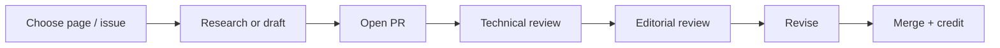

This guide is community-built.

That should mean more than putting a list of names at the bottom of a page.

A good contributor system should make it easy to see:

- who contributed;
- what they contributed;
- where else you can learn from them;
- how their work was reviewed;
- how somebody new can join.

## Current contributors

### Ekemini Samuel

**Focus:** Developer Relations, technical writing, developer education, community building, and public speaking.

**Guide contributions:** Content Creation examples, Mojo Africa case-study material, public-speaking practice, and Developer Champions context.

**Find Ekemini:** [LinkedIn](https://www.linkedin.com/in/ekeminisamuel/) and [Dev.to](https://dev.to/envitab).

### Joy Ndukwe

**Focus:** Community, developer advocacy, and practical product education.

**Guide contributions:** Community-writing example and the Zencoder developer-experience walkthrough.

**Find Joy:** [LinkedIn](https://www.linkedin.com/in/joy-ndukwe/) and [Medium](https://joyndukwe.medium.com/).

### Faith Ayoola Oni

**Focus:** Developer advocacy and beginner-focused technical education.

**Guide contributions:** Content Creation example and ambassador-experience review material.

**Find Faith:** [LinkedIn](https://www.linkedin.com/in/onifaithayoola) and [Dev.to](https://dev.to/ayoola/).

### Samuel Uzor

**Focus:** Developer Relations education and early-career guidance.

**Guide contributions:** Beginner-focused DevRel content example and Advorel experience review.

**Find Samuel:** [LinkedIn](https://www.linkedin.com/in/samuel-uzor98/) and [Hashnode](https://samueluzor.hashnode.dev/).

### Abimbola Adedotun

**Focus:** Developer advocacy and task-focused technical tutorials.

**Guide contributions:** NestJS tutorial examples and Advorel experience review.

**Find Adedotun:** [LinkedIn](https://www.linkedin.com/in/abimbola-adedotun/) and [freeCodeCamp](https://www.freecodecamp.org/news/author/Dotcodes/).

The wider contributor group also includes Renan Garcia, Daniel Umoren, Abdulrasheed Abdulsalam, Happiness Omale, Adetol Jesulayomi, and Laniyan AbdulQawi. Add fuller profiles when their preferred bios, contribution records, and current links have been reviewed.

{/* CONTRIBUTOR REVIEW: Confirm preferred bios and exact contribution credits before expanding the remaining profiles. Photo permission remains unconfirmed for every profile. */}

## What an author profile should show

Use a simple structure.

### Name

**Focus:** Developer Advocacy / Community / Technical Writing / DX / Engineering / etc.

**Contributions to this guide:**

- Page or section
- Case study
- Review
- Media
- Research

**Elsewhere:**

- Website
- Blog
- GitHub
- LinkedIn

Do not add personal details that are unrelated to the work.

## Replace “favorite emoji” with useful context

The existing contributors page includes a “Favorite Emoji” field.

For the updated guide, that space is more useful as:

- **Focus**
- **Contributed to**
- **Website / work**

That fits our move toward a cleaner, professional icon system and makes the page more useful to readers.

## How contribution works

A contributor should be able to move through a predictable path:



For small fixes, this can be much lighter.

For new technical guidance, real-world case studies, or claims about products, we need more review.

## What can you contribute?

Useful contribution types include:

- fix an inaccurate statement;
- update an outdated link;
- improve an explanation;
- add a working example;
- add a diagram;
- contribute a real DevRel story;
- review a page for technical accuracy;
- review a page for beginner clarity;
- add a case study;
- add an accessible caption or alt text;
- improve a checklist or template.

## Contribution quality bar

Before opening a contribution, ask:

- Is this based on real experience, reliable research, or both?
- Can a reader act on it?
- Does it sound like a person explaining the idea?
- Are technical claims verified?
- Are links current?
- Do we have permission for screenshots, client stories, photographs, or quotes?
- Does the change fit the page instead of duplicating another section?

## Give credit precisely

Credit should match the contribution.

Examples:

- **Written by**
- **Contributed by**
- **Technical review by**
- **Case study by**
- **Photo by**
- **Edited by**

Avoid making every contributor look like the author of an entire page when they added one example.

Precise credit builds trust.

## Contributor profile template

```md
### Name

**Focus:** Developer Advocacy, Documentation

**Contributions**
- Public Speaking: technical review
- Documentation Best Practices: AI section

**Find them**
- Website:
- Blog:
- GitHub:
- LinkedIn:
```

## Add yourself

1. Choose an open page or improvement.
2. Read `CONTRIBUTING.md`.
3. Make the change in a branch or fork.
4. Explain what you changed and why.
5. Add sources for research-based claims.
6. Request review.
7. Add your author profile only after the contribution is accepted.

If you are contributing a story about a company, client, community, or event, make sure you have permission to publish the details.

## Community author checklist

- [ ] Preferred display name is confirmed.
- [ ] Public links are working.
- [ ] Contribution type is accurate.
- [ ] Contribution links point to actual pages/PRs.
- [ ] No private contact details are published.
- [ ] Media/quotes have permission.
- [ ] Profile uses the same format as other authors.

## Related pages

- [DXMentorship Sessions](/dx-mentorship-sessions)
- [How to Contribute](/how-to-contribute)
- [Advorel](/advorel)
