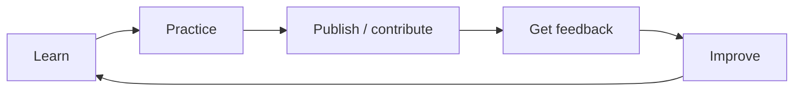

There is no single course that teaches all of DevRel.

That is because DevRel is not one skill.

Depending on the role, you may need some mix of:

- technical depth;
- writing;
- speaking;
- community;
- documentation;
- developer experience;
- measurement;
- product understanding;
- program strategy.

So choose learning resources based on the gap you are trying to close.

## Start with a learning goal

Before enrolling in anything, finish this sentence:

> **In the next eight weeks, I want to get better at ______ so I can ______.**

Examples:

- technical writing → publish two strong tutorials;
- speaking → deliver a 10-minute technical talk;
- community → design a better newcomer journey;
- DevRel fundamentals → understand which role fits me;
- developer experience → run an onboarding audit;
- portfolio → produce evidence I can show in an interview.

A course is useful when it changes what you can do.

## DXMentorship

DXMentorship is a practical Developer Relations mentorship program.

Its public site describes a **seven-week** program designed to help participants build skills, confidence, industry connections, and practical experience for Developer Advocate careers.

It also connects learners with experienced mentors and showcases past mentees and speakers.

**Best for:**

- people exploring or entering DevRel;
- people who learn well through mentorship and accountability;
- learners who want real scenarios rather than only self-paced reading;
- people building confidence and industry context.

**Use it well:**

Do not finish with only notes.

Turn each lesson into evidence:

- a tutorial;
- a talk;
- an event plan;
- a documentation audit;
- a sample project;
- a community contribution.

[Visit DXMentorship](https://dxmentorship.com/)

## DevRel University

DevRel University offers cohort-based learning focused directly on Developer Relations.

Its published curriculum includes topics such as:

- DevRel fundamentals;
- starting a DevRel program;
- stakeholder expectations;
- strategy;
- getting into the field.

**Best for:**

- structured DevRel learning;
- people who want perspectives from working practitioners;
- early-career professionals and people moving into DevRel from another technical role.

[Visit DevRel University](https://www.devreluni.com/)

## DeveloperRelations.com guides and DevRelCon talks

This is less like one course and more like a large practitioner library.

It includes:

- guides;
- conference talks;
- reports;
- career material;
- program design;
- metrics;
- community;
- developer advocacy;
- developer marketing;
- developer enablement.

**Best for:**

- targeted self-study;
- comparing how experienced practitioners solve the same problem;
- going deeper after you already know the basics.

Start with:

- [What is Developer Relations?](https://developerrelations.com/guides/what-is-developer-relations/)
- [The four pillars of Developer Relations](https://developerrelations.com/guides/the-four-pillars-of-developer-relations/)
- [How to get a job in DevRel](https://developerrelations.com/guides/how-to-get-a-job-in-devrel/)
- [DevRel guides](https://developerrelations.com/guides/)

## Google's Technical Writing courses

Google publishes free technical writing courses for engineers and engineering-adjacent roles.

The current learning set includes:

- Technical Writing One;
- Technical Writing Two;
- Technical Writing for Accessibility;
- Writing Helpful Error Messages.

**Best for:**

- Developer Advocates;
- technical writers;
- engineers moving into content;
- anybody whose work includes documentation or tutorials.

Technical Writing One is a particularly good foundation because it covers audience, clarity, sentence structure, terminology, paragraphs, and lists.

[Google Technical Writing](https://developers.google.com/tech-writing)

## Write the Docs learning resources

Write the Docs maintains a large community-driven set of resources on software documentation.

Useful areas include:

- documentation best practices;
- docs as code;
- information architecture;
- API documentation;
- style guides;
- documentation tools;
- conference videos;
- career guidance.

**Best for:**

- documentation-focused DevRel;
- Developer Educators;
- technical writers;
- DX practitioners;
- open-source maintainers.

[Write the Docs learning resources](https://www.writethedocs.org/about/learning-resources/)

## YouTube: use playlists, not random consumption

YouTube is excellent for DevRel learning because much of the field is demonstrated through talks, workshops, live demos, and panels.

The problem is that it is easy to watch a lot and practice nothing.

Use a learning playlist around one question.

For example:

### Public speaking playlist

Collect:

- talk structure;
- live-demo preparation;
- CFP advice;
- presentation accessibility;
- three conference talks you admire.

Then submit or record a talk.

### Community playlist

Collect:

- community strategy;
- moderation;
- champion programs;
- event design;
- feedback loops.

Then design a community program.

### Technical content playlist

Collect:

- tutorial design;
- documentation;
- API education;
- developer video;
- content measurement.

Then publish something.

Useful channels and archives include DevRelCon / DeveloperRelations.com and Write the Docs.

## Build a course stack around the role

### Aspiring Developer Advocate

1. DXMentorship or DevRel University
2. Google Technical Writing One
3. DevRelCon talks on advocacy/speaking
4. Build one sample app
5. Publish one tutorial
6. Give one short talk

### Technical Writer / Developer Educator

1. Google Technical Writing One + Two
2. Write the Docs guide
3. Docs-as-code practice with GitHub
4. Create a small documentation site
5. Run a documentation usability test

### Community-focused DevRel

1. DevRel fundamentals
2. Community-program talks/guides
3. Volunteer in an existing technical community
4. Run one small event or office hour
5. Write a retrospective with evidence

### DX Engineer

1. Product/API fundamentals in your target domain
2. Git/GitHub
3. Documentation systems
4. Onboarding/DX audit practice
5. Build or improve a starter project, SDK example, CLI flow, or error experience

## Evaluate a course before paying

Ask:

- Who teaches it, and have they done the work?
- Is the curriculum current?
- Will I build something?
- Will I receive feedback?
- Is the audience level right for me?
- Can I see sample material?
- Does it teach principles, tools, or both?
- What will I be able to show afterward?
- Is the cost worth the structure, feedback, access, or community?

Do not pay for information you can get free unless the paid experience gives you something valuable beyond information.

That might be:

- feedback;
- mentorship;
- accountability;
- a cohort;
- access to practitioners;
- project review;
- a structured path.

## Turn learning into a portfolio

Use this loop:

A completed course badge is fine.

A working tutorial, talk, community project, documentation contribution, or sample application usually tells a hiring manager much more.

## Course checklist

- [ ] I know the skill gap I am trying to close.
- [ ] The course level matches my current experience.
- [ ] The instructor or organization has credible experience.
- [ ] The material is current enough for the topic.
- [ ] There is a practical output.
- [ ] I have scheduled time to practice.
- [ ] I know what portfolio evidence I will create.
- [ ] I will ask for feedback instead of only consuming content.
