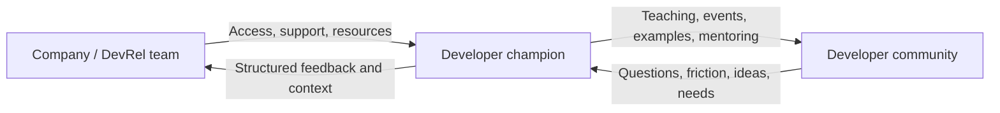

A developer champion program can look deceptively simple from the outside.

Find enthusiastic developers. Give them a title. Send some swag. Ask them to speak about the product.

That is the easy version. It is also where a lot of programs go wrong.

A good champion program is a relationship between a company and people who already care enough about a technology or community to teach, build, organize, answer questions, or help other developers succeed. The program gives those people more support, access, recognition, and room to have an impact.

The goal is not to create an army of unpaid marketers.

The goal is to **help strong community contributors do more of the work they already care about, while keeping the relationship useful for both sides.**

## What is a developer champion?

Different companies use different names:

- developer champion;
- ambassador;
- community expert;
- MVP;
- developer expert;
- campus expert;
- community builder.

The title matters less than the relationship.

A champion is usually someone outside the company's full-time DevRel team who has enough knowledge, trust, or community leadership to help other developers. That may mean speaking, writing, mentoring, answering questions, running events, creating sample projects, maintaining open source, or carrying feedback back to the company.

Google's Developer Experts program, for example, looks for people with strong technical expertise and meaningful community contribution through activities such as speaking, publishing, and mentoring. GitHub's Campus Experts program takes a different shape: it trains student leaders to build inclusive technical communities, run events, and create opportunities on their campuses.

So there is no single champion job description. Start with the community need.

## Why teams create champion programs

A DevRel team cannot be everywhere.

Even a large team has limits: time zones, languages, geography, product specialties, local context, and the number of one-to-one relationships a small group of employees can maintain.

Champion programs can help with four things:

1. **Recognition**: notice and support people who are already contributing.
2. **Education**: help more developers learn through people they already trust.
3. **Reach**: support communities, regions, campuses, languages, or specialties the core team cannot cover well.
4. **Feedback**: create more paths for real developer experience to travel back into the company.

That last one is easy to miss. A champion is not only a person who tells the community what the company is doing. They can also tell the company what the community is experiencing.



If information only flows outward, you have built a promotional channel, not a healthy advocacy loop.

## Decide what problem the program should solve

Do not launch a champion program because other developer companies have one.

Start with the DevRel problem.

DeveloperRelations research describes four useful program archetypes. They are not rules, but they are a good way to force clarity:

| Program shape | Main job | What it might look like | Main risk |
| --- | --- | --- | --- |
| **Reward and motivate** | Recognize existing contribution and improve retention | Recognition, access, thank-you packages, visibility, invitations | The program rewards activity but does not create a path for deeper impact |
| **Force multiplier** | Help trusted contributors extend the DevRel team's work | Event support, review help, resources, mentoring, local activation | The company starts treating volunteers like an extra employee bench |
| **Content-focused** | Scale education and awareness through community-created knowledge | Tutorials, videos, sample apps, talks, translations | Quantity or gamification starts beating quality and authenticity |
| **Land and expand** | Reach communities, regions, campuses, or specialties the core team cannot reach directly | Local events, regional leaders, campus programs, language communities | Quality, trust, support, and governance become harder as the program spreads |

The names are less important than the question behind them:

> **What do we actually need champions to make better?**

If you cannot answer that, wait before recruiting people.

## Recruit for contribution and trust, not follower count

A large audience can be useful. It is not the same thing as being a good champion.

Look for evidence such as:

- helping other developers without being asked;
- technical knowledge or a clear willingness to learn deeply;
- useful writing, talks, demos, open-source work, mentoring, or event leadership;
- the ability to explain things clearly;
- good judgment when representing a community;
- reliability;
- respect for other people;
- a record of giving useful product feedback, not only praise;
- local knowledge that the central team does not have.

Google's Developer Experts criteria are a useful example here: expertise matters, but so does demonstrated community contribution and the ability to give meaningful advice.

The best champion may not be the loudest person in the room.

## Make expectations clear before anyone joins

Ambiguity creates bad relationships.

Before someone accepts a champion role, they should understand:

- what the program is for;
- what champions may choose to do;
- what is optional and what is required;
- how long membership lasts;
- how renewal works;
- what support the company provides;
- whether travel or event expenses can be reimbursed;
- whether the role is paid, unpaid, or includes specific stipends;
- what confidentiality rules exist;
- what code of conduct applies;
- what happens if someone wants to leave;
- what behavior can remove someone from the program.

Do not hide the nature of the relationship behind community language. If a program is voluntary, say that clearly. GitHub, for example, explicitly states in its Campus Experts terms that the program is voluntary and participants are not GitHub employees, while some program-related travel may be reimbursed.

Clarity protects both the company and the champion.

## Give champions useful support

A badge is recognition. It is not a program.

Useful support might include:

- a direct contact inside DevRel;
- product briefings and release context;
- early access where appropriate;
- technical review for talks and articles;
- event or meetup support;
- speaker coaching;
- sample code and demo environments;
- access to product or engineering teams for hard questions;
- travel support where the program offers it;
- promotion of community-created work;
- learning opportunities;
- a private peer community for champions;
- a reliable way to submit feedback and hear what happened next.

GitHub's Campus Experts program is a useful example of investing in the person, not just the output: its official documentation describes training in community analysis, public speaking, technical writing, software development, and impact planning, alongside mentorship and support.

Google's Developer Experts program similarly combines contribution with access, networking, speaking opportunities, and early product exposure.

The principle is simple: **if you want people to grow the community, help them grow too.**

## Do not turn community passion into a quota system

This is one of the most important design choices in a champion program.

You can measure activity without making every relationship transactional.

A rigid rule such as:

> Publish two posts, run one meetup, send ten social posts, and answer twenty questions every month.

may make reporting easier. It can also teach people to optimize for the checklist instead of the community.

DeveloperRelations' guidance on champion-program motivation argues for protecting intrinsic motivation: give people room to contribute in ways that match their strengths and recognize meaningful impact rather than prescribing every action in advance.

That does not mean “have no expectations.” It means distinguish between:

- **program health requirements**: code of conduct, communication, eligibility, disclosure, safety, and basic participation; and
- **contribution choices**: writing, speaking, mentoring, organizing, coding, translating, answering questions, or another useful form of contribution.

A great writer should not have to become an event organizer to keep a badge.

## Watch for burnout and exploitation

Champion programs can become unhealthy when the company sees community goodwill as free labor.

Warning signs include:

- the same few people receiving every request;
- urgent asks becoming normal;
- champions doing employee-level work without employee-level support;
- contribution quotas that ignore jobs, families, school, or health;
- pressure to say positive things about products;
- no safe way to say no;
- no reimbursement for significant approved expenses;
- recognition disappearing while requests keep increasing.

The DevRelCon research on champion programs makes this point directly: force-multiplier programs can create community burnout if teams forget that champions have full-time jobs and lives outside the program.

A healthy program should make it easy to decline an opportunity without damaging the relationship.

## Build a real feedback path

Champions often see problems before dashboards do.

They hear:

- “I cannot get the quickstart working.”
- “The documentation assumes I already know this.”
- “Everyone in our meetup is asking about the same integration.”
- “This API works differently from what developers expect.”
- “People in this region cannot use the payment method in the tutorial.”
- “The new release broke the sample we teach with.”

Do not leave that knowledge in DMs.

Create a lightweight path:

```text
Champion observation
        ↓
Context + evidence
        ↓
DevRel triage
        ↓
Product / Docs / Engineering / Support
        ↓
Decision or change
        ↓
Close the loop with the champion
```

Closing the loop matters. People stop sending useful feedback when every report disappears into a form and nothing comes back.

## Measure the health of the program, not just output

Counting talks and blog posts is easy. It is not enough.

Track a mix of program, community, and relationship signals.

| Area | Useful signals |
| --- | --- |
| **Participation** | Active champions, retention, renewal, contribution mix |
| **Community value** | Developers helped, event participation, useful questions answered, resources reused |
| **Education** | Workshop completion, tutorial use, sample-repo activity, repeated-question reduction |
| **Reach** | Regions, languages, campuses, or specialties supported that the core team could not cover |
| **Feedback** | Actionable issues surfaced, feedback acknowledged, improvements influenced |
| **Champion experience** | Satisfaction, support quality, burnout signals, reasons people leave |
| **Business connection** | Qualified adoption or activation signals where attribution is defensible |

Do not reduce people to an output leaderboard.

If a champion prevented a major documentation problem, mentored three new organizers, or helped a local community trust the company enough to give honest feedback, that may matter more than ten low-value posts.

## Examples of different program models

### Google Developer Experts

Google describes GDEs as professionals with strong expertise in Google technologies who contribute to the developer community through activities such as speaking, publishing, mentoring, and sharing best practices. The program combines recognition with community, access, and professional growth.

Study this model when you are thinking about **expertise + education + recognition**.

### GitHub Campus Experts

GitHub's program is built around student leaders who grow inclusive technical communities on campus. It includes training, mentorship, and support for activities such as workshops, meetups, webinars, hackathons, and open-source work.

Study this model when you are thinking about **local leadership + training + land-and-expand community growth**.

## Stories from the DXMentorship / Advorel community

### Ekemini's Mojo Africa community work

Mojo Africa helps African developers learn about Mojo, MAX, GPU programming, AI infrastructure, and the wider Modular ecosystem. This is champion work because it gives an emerging global technology local context, education, and a community feedback path.

The public [Mojo Africa meetup page](https://luma.com/mojo-africa) identifies Ekemini Samuel as a host and describes the event as community-led. The project record documents a second major event in Uyo on May 2, 2026 with the theme **The Role of Mojo in AI Infrastructure**. Modular supported the event with sponsorship.

The recorded attendance was 98 people: 78 in person and 20 online. The in-person group included 30 developers, 10 students, 30 technology enthusiasts, and 8 newcomers. Sessions covered the two-language problem, Mojo, Mojo 1.0, MAX, AI infrastructure, and ways to improve efficiency in AI delivery. The event also produced a livestream, photographs, and a recap.

These figures describe participation, not adoption. We do not yet have evidence that attendees installed Mojo, built projects, or continued using the technology afterward.

What this teaches us about developer champions:

- champions translate a global product into local learning needs;
- education often has to come before adoption;
- mixed-experience audiences need layered explanations;
- sponsorship helps, but local trust and organization make the event work;
- livestreams and recaps extend an event beyond the room; and
- follow-up questions and projects are stronger adoption evidence than attendance alone.

### Joy and Faith's ambassador experience

The project audit identifies Joy Ndukwe and Faith Ayoola Oni as contributors with ambassador experience. Their public writing already shows two relevant advocacy skills: Joy explains community ideas in conversational language, while Faith builds beginner-focused technical education around a developer product.

Those artifacts demonstrate education and communication, but they do not verify a specific ambassador program. Before naming a brand or program, confirm the program, dates, responsibilities, support received, and permission to publish. Their final inserts should show how they represented a product, supported developers, collected feedback, and balanced company goals with community trust.

{/* CONTRIBUTOR REVIEW: Confirm Joy and Faith's ambassador program details before adding brand names, dates, or outcomes. */}

## If you are designing a champion program

Before launch, check that you can answer these questions:

### Strategy

- [ ] What DevRel problem are we solving?
- [ ] Why is a champion program the right tool for it?
- [ ] What does success look like for the community, the champions, and the company?

### Selection

- [ ] Are selection criteria based on contribution, trust, expertise, potential, or community leadership rather than follower count alone?
- [ ] Is the application or nomination process understandable?
- [ ] Do we have a fair way to review and renew membership?

### Relationship

- [ ] Are the role, expectations, term, benefits, and boundaries clear?
- [ ] Can champions say no to requests?
- [ ] Are compensation, reimbursement, and employment status explained accurately?
- [ ] Is there a code of conduct and an escalation path?

### Support

- [ ] Does every champion know who to contact?
- [ ] Are we giving training, resources, technical help, access, or recognition that makes the relationship valuable to them?
- [ ] Can champions get difficult questions answered?

### Feedback

- [ ] Is there a repeatable way to collect developer feedback?
- [ ] Can the right internal teams see it?
- [ ] Do we close the loop when something changes?

### Health

- [ ] Are we watching burnout and contribution concentration?
- [ ] Are we measuring impact without turning people into a content quota?
- [ ] Do we ask champions how the program feels from their side?

A developer champion program works when people on both sides would still describe the relationship as valuable even if you removed the badge.

## Further reading

- [Google Developer Experts](https://developers.google.com/community/experts/)
- [GitHub: About GitHub Campus Experts](https://docs.github.com/en/education/about-github-education/use-github-at-your-educational-institution/about-github-campus-experts)
- [GitHub Campus Experts](https://github.com/education/students/campus-expert)
- [DeveloperRelations: The four archetypes of developer champion programmes](https://developerrelations.com/talks/the-four-archetypes-of-developer-champion-programmes/)
- [DeveloperRelations: Developer champion programs: Encouraging contribution without killing motivation](https://developerrelations.com/guides/developer-champion-programs-motivation/)

## Related pages

- [Community Building](/community-building)
- [Events and Meetups](/events-and-meetups)
- [Reporting to Leadership](/reporting-to-leadership)
