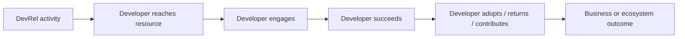

DevRel teams do a lot of visible work.

They publish tutorials, speak at conferences, run communities, answer questions, improve documentation, support launches, collect product feedback, and help developers get unstuck.

That makes measurement tempting: count everything.

But a long dashboard can still fail to answer the most important question:

> **Is our work helping developers succeed, and is that success moving something the organization actually cares about?**

KPIs and OKRs are useful when they help answer that question. They are not useful when they turn DevRel into a contest for the highest number of posts, events, impressions, or community members.

## Start with the purpose of the DevRel program

There is no universal DevRel KPI set.

A team whose job is to improve API adoption should not use the same scorecard as a team building an open-source contributor community. A program focused on enterprise enablement will care about different signals from a program focused on awareness among students.

Start with the reason the organization invests in DevRel.

Common goals include:

- help more developers discover the product;
- help developers reach a first successful experience faster;
- increase product or API adoption;
- improve developer satisfaction and trust;
- grow a healthy technical community;
- reduce repeated friction in onboarding or support;
- improve the product through developer feedback;
- support retention, expansion, or revenue influence where that relationship can be measured responsibly.

The goal comes first. The metric comes after.

## KPI and OKR are not the same thing

A **KPI** is a metric you monitor because it tells you something important about the health or performance of a program.

An **OKR** gives a team a direction and defines measurable results that show whether the team is moving toward it.

A simple way to think about them:

| | KPI | OKR |
| --- | --- | --- |
| Main job | Monitor an important signal | Drive progress toward a specific goal |
| Shape | Metric | Objective + measurable key results |
| Lifespan | Often ongoing | Usually set for a defined period |
| Example | Median time to first API call | Improve first-time developer activation this quarter |

A KPI can become a Key Result when the team deliberately wants to move it.

For example:

- **KPI:** 42% of new developers make a successful API call within 24 hours.
- **Objective:** Make the first developer experience feel fast and dependable.
- **Key Result:** Increase the share of new developers who make a successful API call within 24 hours from 42% to 60% by the end of the quarter.

## Measure outcomes, not just output

This distinction matters a lot in DevRel.

An **output** is something the team produced.

An **outcome** is something that changed because developers were better able to understand, adopt, use, or advocate for the technology.

| Output | Possible outcome |
| --- | --- |
| Publish 10 tutorials | More developers complete onboarding successfully |
| Run 4 workshops | More attendees build and keep using the product afterward |
| Answer 300 community questions | Repeated questions fall because docs/product friction is fixed |
| Create a sample app | More developers complete the target integration |
| Speak at 6 events | Qualified developers visit docs, try the SDK, or join the technical community |

Outputs still matter operationally. You need to know whether the team is doing the work it committed to do.

The problem starts when the output becomes the definition of success.

> **“Publish 12 articles” is a plan. “Increase successful onboarding from 35% to 50%” is a result.**

## Build a measurement chain

A useful DevRel measurement model connects activities to developer behavior and then to broader outcomes.



For example:

```text
Tutorial
   ↓
Developer reads the setup guide
   ↓
Developer completes the sample
   ↓
Developer makes the first API call
   ↓
Developer builds a real integration
   ↓
Active product usage grows
```

The further you move down the chain, the more valuable the signal can become: and the harder direct attribution usually becomes.

That is why measurement needs both confidence and humility.

## Time to the “aha” moment

The audit for this guide specifically calls out **time to aha** as a metric worth discussing.

The “aha” moment is the point where a developer first experiences enough value to understand why the product matters to them.

That moment is different for every product.

It might be:

- the first successful API response;
- the first model served;
- the first deployment completed;
- the first useful result returned from an SDK;
- the first pull request created by an agent;
- the first dashboard populated with real data.

So do not start by asking, “What is our time-to-aha?”

Start by asking:

> **What observable event tells us that a new developer has experienced the product's core value?**

Then measure the time between a meaningful start point and that event.

```text
Account created / SDK installed / docs opened
                    ↓
             Developer journey
                    ↓
       First meaningful product success
```

Possible measures include:

- median time to first successful API call;
- percentage of signups reaching first success within 10 minutes, 1 hour, or 24 hours;
- completion rate for the getting-started path;
- number of errors or retries before first success;
- points where developers abandon the journey.

The useful thing about this metric is not the number by itself. It is what the journey teaches you about friction.

## Measure adoption beyond signups

A signup can mean curiosity. Adoption means the product has become useful enough for someone to keep using it.

Depending on the product, stronger adoption signals may include:

- first successful API call;
- repeated API calls over multiple days;
- SDK installation followed by real usage;
- creation of a production project;
- deployment of an integration;
- use of a second feature after the first success;
- return usage after 7, 30, or 90 days;
- repository contributions;
- active use by multiple members of a developer team.

Define adoption explicitly. Otherwise two teams can use the same word while measuring completely different behavior.

## Use leading and lagging indicators together

A **leading indicator** gives you an earlier signal that progress may be happening.

A **lagging indicator** tells you whether the larger result eventually happened.

Example:

| Goal | Leading signals | Lagging signals |
| --- | --- | --- |
| Improve onboarding | quickstart completion, time to first success, setup error rate | activated developers, 30-day usage |
| Grow API adoption | SDK installs, docs-to-dashboard conversion, first API calls | active integrations, API usage over time |
| Strengthen community | helpful replies, returning contributors, event follow-up | contributor retention, product/community advocacy |
| Improve docs | successful searches, task completion, fewer repeated questions | developer satisfaction, lower onboarding friction |

Do not wait three months for a lagging metric if an earlier signal can tell you the onboarding path is broken today.

At the same time, do not celebrate a leading signal as though the final outcome is guaranteed.

## Write DevRel OKRs around change

A good Objective describes the direction you want to move in. The Key Results tell you how you will know something actually changed.

### Example 1: Developer activation

**Objective:** Make the first experience with our API fast and dependable.

**Key Results:**

1. Increase successful quickstart completion from 48% to 70%.
2. Reduce median time to first successful API call from 22 minutes to under 10 minutes.
3. Reduce onboarding-related support requests per 100 new developers by 25% without reducing support satisfaction.

Possible initiatives:

- rewrite the quickstart;
- add a runnable sample;
- improve authentication errors;
- run onboarding usability tests.

Notice that the initiatives are **not** the Key Results.

### Example 2: Technology adoption

**Objective:** Help more developers move from exploring the SDK to using it in real projects.

**Key Results:**

1. Increase the percentage of new SDK users who complete a working integration from 20% to 32%.
2. Increase 30-day retained SDK usage from 38% to 48%.
3. Reduce the top three documented integration blockers by at least 30% each.

Possible initiatives:

- publish integration tutorials;
- improve starter repositories;
- run office hours;
- fix recurring product/documentation friction.

### Example 3: Developer community

**Objective:** Build a community where developers regularly help one another succeed.

**Key Results:**

1. Increase the percentage of technical questions answered by community members from 18% to 30%.
2. Increase returning monthly contributors from 45 to 65.
3. Maintain a median unanswered technical-question age below 24 hours.

Possible initiatives:

- launch a contributor recognition program;
- improve onboarding for community helpers;
- host technical deep dives;
- document recurring questions.

## Add guardrail metrics

A target can produce the wrong behavior if people optimize for the number instead of the real goal.

If the only target is **number of articles**, quality can drop.

If the only target is **questions answered**, people may rush replies instead of fixing the root cause.

If the only target is **community size**, acquisition can grow while the actual community becomes less useful.

Add a guardrail when the main metric creates an obvious risk.

Examples:

| Primary target | Useful guardrail |
| --- | --- |
| Faster support response | Resolution quality / satisfaction |
| More content traffic | Tutorial completion / product relevance |
| More community members | Active or returning-member rate |
| Faster onboarding | Error rate / support burden / satisfaction |
| More signups | Activation and retained usage |

## Avoid vanity metrics without context

These metrics are not automatically useless:

- followers;
- impressions;
- page views;
- event registrations;
- community member count;
- video views;
- GitHub stars.

They become weak when the team cannot explain what decision the number helps them make.

For every metric, ask:

1. What behavior does this represent?
2. Why do we care about that behavior?
3. What can make the number move without creating real value?
4. What decision would we make if it rises?
5. What decision would we make if it falls?

If the answer is “none,” it may be dashboard decoration.

## Be careful with revenue attribution

DevRel can influence revenue, especially when it helps developers adopt a technology, succeed during evaluation, expand usage, or advocate for a product inside an organization.

But influence is not the same as exclusive credit.

A developer may read a tutorial, attend a workshop, speak with sales, test the product for weeks, get internal approval, and then convert after a product release.

Calling the entire contract “DevRel revenue” would overstate the evidence.

Use language that matches what you can prove:

- **sourced** when DevRel clearly originated the opportunity under an agreed attribution rule;
- **influenced** when DevRel touchpoints are part of the documented journey;
- **correlated** when the relationship is visible but causality is not established.

We will go deeper into this on the **Qualitative vs Quantitative Metrics** and **Reporting to Leadership** pages.

## A DevRel KPI scorecard

A compact scorecard is often more useful than a dashboard with fifty numbers.

| Layer | Question | Example metrics |
| --- | --- | --- |
| Reach | Are the right developers finding us? | qualified docs traffic, event reach, content discovery |
| Engagement | Are they going deeper? | tutorial completion, repo activity, technical questions |
| Activation | Did they experience first value? | first API call, first deployment, time to aha |
| Adoption | Are they continuing to use it? | active integrations, repeated usage, feature adoption |
| Community | Are relationships getting stronger? | returning contributors, peer answers, retention |
| Experience | Is the journey getting easier? | friction rate, support themes, satisfaction |
| Business | Is developer success connected to company goals? | influenced pipeline, retained accounts, expansion signals where measurable |

Not every team needs a metric in every row.

Choose the smallest set that represents the program you are actually running.

## Review the metric, not just the number

Metrics can stop being useful.

Every quarter, ask:

- Does this KPI still represent something we care about?
- Can the team influence it?
- Do we understand its baseline and data source?
- Is the definition stable?
- Are we measuring a developer outcome or just our own activity?
- Has the metric created any unwanted behavior?
- Do we need a qualitative signal beside it?

A metric is a tool for learning and decision-making. It is not the mission.

## KPI and OKR checklist

- [ ] We can explain the purpose of the DevRel program before naming its metrics.
- [ ] Each KPI has a clear definition and data source.
- [ ] We distinguish outputs from outcomes.
- [ ] We define what “activation,” “adoption,” and “active developer” mean for our product.
- [ ] We know what event represents the first meaningful “aha” moment.
- [ ] Our OKR Key Results measure change, not a list of tasks.
- [ ] We use leading and lagging indicators where they help us see the full journey.
- [ ] We add guardrail metrics where optimization could damage quality.
- [ ] We do not claim causal attribution we cannot support.
- [ ] We review metrics regularly and remove ones that no longer help decisions.

## Further reading

- [State of Developer Relations 2024](https://www.stateofdeveloperrelations.com/2024devrelreport)
- [DeveloperRelations.com: What is Developer Relations?](https://developerrelations.com/guides/what-is-developer-relations/)
- [Atlassian: OKR Guide and Template](https://www.atlassian.com/team-playbook/plays/okrs)
