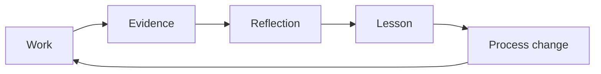

A lesson is more useful when it costs you something.

Maybe an event got plenty of registrations but poor follow-through.

Maybe a tutorial was accurate when it shipped and broken two months later.

Maybe the team answered the same community question fifty times before realizing the real fix belonged in the product.

Maybe a KPI looked impressive until somebody asked what changed for developers.

Those are the stories worth keeping.

## Do not turn lessons into motivational quotes

“Consistency is key” is not a lesson.

A useful lesson sounds more like this:

> We posted every week for three months, but most of the topics came from our internal launch calendar rather than developer questions. Reach increased, but product activation did not. We changed the editorial process so every topic had to be tied to a developer problem or product journey.

That gives the reader something they can test.

## Capture the decision, not only the result

A good lesson has this structure:

```text
What we believed
      ↓
What we did
      ↓
What happened
      ↓
What the evidence changed in our thinking
      ↓
What we do now
```

This is useful because DevRel decisions are often made with incomplete information.

The point is not to prove that the team was always right.

The point is to get better.

## Common lessons in DevRel work

The following are recurring patterns worth testing against your own experience.

### Activity is not impact

A busy calendar can hide a weak program.

Events, posts, videos, replies, and impressions tell you that work happened.

They do not automatically tell you that developers:

- understood the product;
- reached first success;
- stayed;
- contributed;
- recommended it;
- had less friction.

Keep operational metrics. Just do not confuse them with outcomes.

### The first developer experience matters more than the perfect campaign

A launch can drive thousands of people to a product.

If the quickstart is unclear, authentication is confusing, or the first example fails, DevRel may simply be sending more people into the same friction.

Before increasing traffic, walk through the journey yourself.

### Repeated support questions are product data

If the same question appears again and again, the community team is not necessarily failing.

The repeated question may be telling you:

- the docs are unclear;
- the UI label is confusing;
- the error message is poor;
- the API is surprising;
- the sample is missing;
- the product needs a better default.

Answer the developer, then investigate the system.

### Community size is not community health

A member count is easy to screenshot.

More useful questions are:

- Do people return?
- Do members help one another?
- Can newcomers find a path in?
- Do contributors feel recognized?
- Are unanswered questions growing?
- Does feedback reach the team?

### Content needs maintenance

Publishing is the start of a technical content lifecycle, not the end.

SDKs change.

APIs deprecate fields.

Dependencies break.

Screenshots age.

Assign ownership to important content and make updating it part of the work.

### A champion program needs a value exchange

Ambassadors and champions are people, not a free distribution channel.

If the program only asks members to produce content, attend events, and promote the brand, it will eventually feel extractive.

Give participants:

- access;
- learning;
- recognition;
- relationships;
- influence;
- useful resources;
- a clear path to grow.

### Attribution gets weaker as the chain gets longer

A developer saw a talk, read a tutorial two weeks later, joined a community, asked a question, built a prototype, and then their company became a customer.

Did the talk create the revenue?

It may have influenced the journey. That is different from proving causation.

Say what the evidence supports.

### Internal communication is part of DevRel

Great external work can still fail internally if Product never hears the feedback, Sales does not know what the community is asking, or leadership only sees a list of activities.

A DevRel program needs an internal feedback and reporting rhythm.

### Every channel does not need the same content

A 2,000-word tutorial pasted into a Discord announcement is not distribution.

Adapt the idea to the channel:

- full explanation in docs/blog;
- visual or key insight on social;
- focused answer in community;
- demonstration in video;
- hands-on practice in a workshop.

## Lessons supported by current Advorel examples

### Education comes before adoption

The Mojo Africa case shows why an emerging technology needs context before promotion. Developers first need to understand the infrastructure problem, the role of the technology, and how to begin experimenting. An event can create that starting point, but follow-up learning and project evidence show whether the work continues.

### Published output is evidence of work, not proof of impact

The contributor articles linked in this guide are verifiable artifacts. They show technical knowledge, audience choices, and teaching approaches. They do not prove adoption, revenue, or conversion without separate evidence. A responsible report keeps those claims apart.

### Different developer problems need different content shapes

The team's published work ranges from beginner explainers to implementation tutorials and community essays. The useful lesson is to choose the format after identifying the reader's problem. A complete project tutorial and a short conceptual explanation solve different jobs.

The next review should add firsthand trade-offs: what took longer than expected, what contributors changed after feedback, and what they would stop or repeat.

{/* CONTRIBUTOR REVIEW: Add approved firsthand trade-offs and process changes when the interviews are complete. */}

Use this short interview:

1. What project were you working on?
2. What did you initially expect to happen?
3. What actually happened?
4. What surprised you?
5. What evidence changed your mind?
6. What did you stop, start, or change?
7. What would you tell somebody doing the same work next month?
8. What part can we publish?

## Write lessons with evidence

A useful format:

### Lesson

One clear sentence.

### Situation

What was happening?

### Signal

What did you see or hear?

### Change

What did the team do differently?

### Result

What happened after the change, if known?

### Confidence

Observed, reported, correlated, influenced, or causal.

## Build a team learning loop



Without the process change, a lesson is just a note.

Useful places to apply lessons include:

- editorial checklists;
- event runbooks;
- onboarding docs;
- product feedback templates;
- champion-program rules;
- reporting dashboards;
- interview guides;
- budget decisions.

## Hold a short retrospective

After a meaningful project, ask:

- What worked better than expected?
- What created unnecessary friction?
- What did developers tell us?
- What did the data show?
- Where did those disagree?
- What did we spend time on that did not matter?
- What should become a reusable process?
- What should we stop doing?
- What still needs evidence?

Keep the retrospective short enough that the team will actually do it.

## Lessons learned checklist

- [ ] The lesson comes from a specific situation.
- [ ] The contributor can verify the story.
- [ ] We show the original assumption where useful.
- [ ] We distinguish observation from interpretation.
- [ ] We explain the process change that followed.
- [ ] Confidential client or community information is removed.
- [ ] The lesson is useful to someone outside the original project.
- [ ] We avoid turning one experience into a universal rule.
- [ ] Contributor review and permission are complete.

## Related pages

- [Real-Life Examples](/real-life-examples)
- [Case Studies & Stories](/case-studies)
- [KPIs and OKRs](/kpi-and-okrs)
