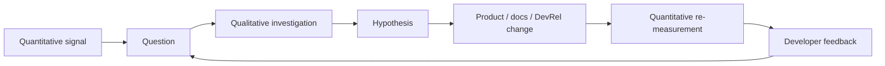

Numbers tell you **what is happening at scale**.

Developer stories help you understand **why it is happening**.

DevRel usually needs both.

If tutorial completion drops from 72% to 41%, the number tells you there is a problem. It does not tell you whether developers are confused by authentication, hitting a broken command, choosing the wrong guide, or abandoning the product because it does not solve their problem.

On the other hand, one developer saying “the setup is impossible” can reveal a real issue, but it does not tell you how common that issue is.

The useful question is not:

> **Should we use qualitative or quantitative metrics?**

It is:

> **What do we need to understand, and what combination of evidence will give us the clearest answer?**

## What quantitative evidence gives you

Quantitative evidence is numerical.

It helps you see patterns, scale, trends, rates, and changes over time.

Examples in DevRel include:

- documentation traffic;
- quickstart completion rate;
- time to first successful API call;
- SDK downloads;
- API usage;
- active developers;
- returning community members;
- event registrations and attendance;
- repository contributions;
- support volume;
- developer satisfaction scores;
- influenced pipeline or revenue where attribution rules exist.

Numbers are useful for questions such as:

- Is onboarding improving?
- Did activation increase after the documentation change?
- Where do developers abandon the setup flow?
- Is community participation growing or just membership count?
- Are active integrations increasing month over month?

But numbers do not explain themselves.

## What qualitative evidence gives you

Qualitative evidence captures experiences, language, context, motivations, and explanations.

Examples include:

- interviews;
- open-ended survey responses;
- community conversations;
- support-ticket themes;
- usability-test observations;
- event questions;
- GitHub issue discussions;
- developer feedback shared with advocates;
- notes from sales, solutions engineering, product, or support conversations.

Qualitative evidence helps answer questions such as:

- Why are developers abandoning the quickstart?
- What do they expect the product to do?
- Which part of the API feels confusing?
- Why are community contributors staying?
- What is making evaluation difficult inside an enterprise?
- Why does a metric look better while developers still sound frustrated?

Good qualitative work does more than collect memorable quotes. Look for repeated themes, contradictory experiences, edge cases, and language developers use to describe the problem.

## Use the two together

The strongest measurement loops often move between quantitative and qualitative evidence.



### Example: onboarding

**Quantitative signal:**

Quickstart completion falls from 68% to 46% after a product update.

**Qualitative investigation:**

Five usability sessions and repeated Discord questions show that developers do not understand a new authentication step.

**Action:**

The team changes the onboarding flow, rewrites the authentication section, and improves the error message.

**Re-measurement:**

Quickstart completion rises and the repeated authentication question becomes less common.

The number identified the pattern. The conversations explained it. The follow-up measurement tested whether the fix worked.

## Better developer experience needs both kinds of evidence

The audit for this page specifically asks us to connect measurement with **better developer experience**.

Developer experience includes things that telemetry can observe and things developers themselves have to tell you.

You can measure:

- build time;
- time to first success;
- support response time;
- error rate;
- setup completion;
- documentation search success;
- pull-request cycle time;
- repeated product usage.

But you may also need to ask:

- Did the developer understand what to do?
- Did the workflow feel predictable?
- Did they trust the output?
- Which part required the most mental effort?
- Did they have enough context to recover when something failed?
- Would they choose this tool again?

GitHub's DevEx research is a useful example of this mixed approach: developer-reported experience is studied alongside observed or operational signals rather than assuming telemetry tells the whole story.

## Increased revenue is a result, not an explanation

The audit also asks us to discuss **increased revenue**.

Revenue can matter to DevRel, but it sits far downstream from many DevRel activities.

A developer's path might look like this:

```text
Conference talk
      ↓
Documentation visit
      ↓
SDK evaluation
      ↓
Community question
      ↓
Technical proof of concept
      ↓
Product / sales conversation
      ↓
Internal approval
      ↓
Paid adoption
```

If revenue increases, you still need to understand what role DevRel played.

Useful **quantitative** evidence may include:

- opportunities with documented DevRel touchpoints;
- conversion rates for developer-originated evaluations;
- expansion after technical enablement;
- product usage among accounts that engaged with DevRel;
- pipeline or revenue under an agreed attribution model.

Useful **qualitative** evidence may include:

- a buyer saying a workshop gave the engineering team confidence to evaluate the product;
- a developer describing how documentation unblocked the proof of concept;
- a solutions engineer noting that a DevRel sample shortened an enterprise evaluation;
- an account team documenting how a community advocate influenced internal adoption.

Neither kind of evidence should be stretched beyond what it proves.

A tracked DevRel touchpoint does not automatically mean DevRel caused the purchase. A customer story does not automatically tell you how common that path is.

## Think in levels of confidence

You do not have to pretend every metric proves causality.

Use language that matches the evidence.

### Observed

> “35% of activated developers viewed the new quickstart before first success.”

This is a measured relationship.

### Reported

> “Developers in interviews repeatedly said the new sample made authentication easier to understand.”

This is firsthand qualitative evidence.

### Correlated

> “Accounts that engaged with the workshop series had a higher evaluation-to-activation rate.”

This is an association. Other factors may explain it.

### Influenced

> “The opportunity had documented DevRel touchpoints under our agreed influence model.”

This is an attribution convention, not proof that DevRel alone caused the result.

### Causal

> “Changing X caused Y.”

Use causal language only when the research design actually supports it: for example, a well-designed experiment or another strong causal method.

This vocabulary keeps reporting credible.

## Do not let averages hide the journey

Suppose average time to first API call is 14 minutes.

That sounds useful until you discover:

- half of developers finish in 4 minutes;
- a smaller group spends 45 minutes fighting authentication;
- some never succeed and are missing from the average entirely.

Where possible, look beyond one aggregate number.

Useful views include:

- median and percentiles;
- completion and abandonment rates;
- segments by SDK, language, region, plan, or developer type where appropriate and privacy-safe;
- cohorts before and after a change;
- new versus returning developers;
- successful versus unsuccessful journeys.

Then use qualitative investigation to understand the groups that look different.

## Segment qualitative feedback too

Do not treat “the community” as one person.

A student learning the technology, a senior platform engineer evaluating it for enterprise use, an open-source maintainer, and an existing customer can experience the same documentation very differently.

When you summarize feedback, preserve useful context:

- developer stage;
- task they were trying to complete;
- environment or integration;
- whether they are evaluating or already using the product;
- frequency of the theme;
- severity of the friction.

Avoid collecting personal information you do not need.

## Triangulate important decisions

For high-impact decisions, try not to rely on one source of evidence.

A simple triangulation model:

| Question | Quantitative | Qualitative | Additional evidence |
| --- | --- | --- | --- |
| Is onboarding broken? | completion rate, time to success | usability sessions, support themes | error logs |
| Is the community healthy? | returning members, peer replies | member interviews | contribution quality |
| Did the tutorial help adoption? | tutorial-to-activation path | reader feedback | sample repo usage |
| Is DX improving? | friction/time/error metrics | developer surveys/interviews | support trends |
| Did DevRel influence revenue? | attributed touchpoints, conversion data | account/developer stories | CRM notes, product usage |

When different sources point in the same direction, confidence increases.

When they disagree, that disagreement is useful information.

## Watch for common measurement traps

### “The number went up, so the program worked”

Something else may have changed at the same time: product pricing, a launch, seasonality, sales activity, paid marketing, or a major release.

### “Three developers said it, so everyone thinks it”

Qualitative evidence reveals possibilities and depth. It does not automatically establish prevalence.

### “The survey score is objective because it is a number”

A survey turns human perception into numerical data. The question wording, sample, response rate, and context still matter.

### “More engagement is always better”

A community may have more messages because the product is confusing. A support forum may grow because documentation is failing.

### “Revenue is the only metric leadership cares about”

Leadership usually cares about company outcomes. Depending on the business, developer adoption, retention, product feedback, ecosystem strength, support efficiency, or strategic account enablement can all connect to those outcomes.

The job is to make the connection clear without overstating it.

## A mixed-method DevRel review

A useful monthly or quarterly review can include four parts.

### 1. What changed in the numbers?

Keep this small. Show the metrics tied to the team's current goals.

### 2. What are developers telling us?

Summarize repeated themes, not a random collection of quotes.

### 3. What do we think explains the pattern?

Separate evidence from hypothesis.

### 4. What will we change or test next?

Measurement should lead to a decision.

Example:

> **Signal:** Time to first success increased 35% after the SDK release.
> **Developer evidence:** Most onboarding complaints mention the new configuration format.
> **Hypothesis:** The migration note assumes knowledge new users do not have.
> **Next action:** Rewrite the configuration step, add a working starter file, and re-test the journey with five first-time users.
> **Measure again:** Completion rate, time to success, and frequency of the configuration complaint.

That is more useful than a slide with twenty charts and no decision.

## Qualitative and quantitative measurement checklist

- [ ] We know the question we are trying to answer before choosing a metric.
- [ ] Quantitative measures have clear definitions, baselines, and data sources.
- [ ] Qualitative evidence preserves enough context to understand the developer's task.
- [ ] We look for repeated themes rather than cherry-picking memorable quotes.
- [ ] We use both observed behavior and developer-reported experience when the question needs both.
- [ ] We segment data when an average can hide important differences.
- [ ] We distinguish observation, report, correlation, influence, and causality.
- [ ] We do not claim revenue attribution beyond the evidence or agreed attribution model.
- [ ] We investigate disagreement between data sources instead of hiding it.
- [ ] Measurement leads to a decision, experiment, or follow-up question.

## Further reading

- [GitHub: Good DevEx increases productivity: research](https://github.blog/news-insights/research/good-devex-increases-productivity/)
- [GitHub: Quantifying Copilot's impact on productivity and happiness](https://github.blog/news-insights/research/research-quantifying-github-copilots-impact-on-developer-productivity-and-happiness-/)
- [DeveloperRelations.com: Measuring progress in Developer Relations](https://developerrelations.com/talks/measuring-progress-in-developer-relations/)
- [State of Developer Relations 2024](https://www.stateofdeveloperrelations.com/2024devrelreport)
