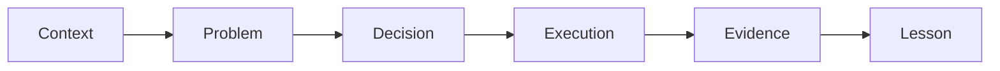
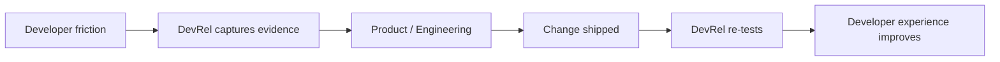

A real-life example should do more than prove that somebody did some DevRel work.

It should help the reader answer:

> **What happened, what did the team do, what changed, and what can I reuse?**

That sounds simple, but many case studies skip the useful middle.

They say a team launched a community, published content, or ran an event. Then they jump straight to “it was a success.”

The interesting part is everything between those two sentences.

## What makes an example useful?

A strong example has six parts.



### 1. Context

Give the reader enough information to understand the environment.

- What kind of product or community was involved?
- Who were the developers?
- What stage was the program in?
- What constraints mattered?

### 2. Problem

Be specific.

Weak:

> We wanted to improve engagement.

Better:

> New members were joining the Discord, but many never posted after their first week.

### 3. Decision

Explain why the team chose one approach over another.

That is where the reader learns judgment.

### 4. Execution

Show the actual work:

- content;
- event;
- program;
- documentation change;
- feedback loop;
- technical demo;
- campaign;
- onboarding change.

### 5. Evidence

Use the strongest evidence you actually have.

That might include:

- attendance;
- completion rates;
- product usage;
- support data;
- contributor activity;
- feedback;
- developer interviews;
- screenshots;
- before/after documentation;
- a shipped product change.

Do not invent a metric because the story feels incomplete without one.

### 6. Lesson

What would you repeat?

What would you change?

What surprised you?

That is often the most valuable part.

## Use evidence labels

Not every example can prove causation.

So label the evidence honestly.

| Label | Meaning |
| --- | --- |
| Observed | We directly saw this happen |
| Reported | A developer or participant told us this |
| Correlated | Two changes happened together |
| Influenced | DevRel plausibly contributed alongside other work |
| Causal | We have strong evidence the intervention produced the result |

This keeps case studies useful without turning them into marketing fiction.

## Advorel examples we can study now

### Community education through Mojo Africa

**Context:** Mojo and the Modular ecosystem were unfamiliar to many people in the target region.

**Problem:** Developers needed local explanations, demonstrations, and a community where they could continue learning.

**Decision:** Ekemini Samuel and Mojo Africa used a community-led event in Uyo to connect AI infrastructure concepts with Mojo, MAX, GPU programming, and the wider Modular ecosystem.

**Execution:** The May 2, 2026 event combined an in-person program, virtual attendance, technical explanations, a livestream, photographs, and a recap. Modular provided sponsorship.

**Evidence:** The project record documents 98 attendees, including 78 in person and 20 online. The public [event page](https://luma.com/mojo-africa) confirms the community-led format, location, topic, and Ekemini as a host.

**Limit:** Attendance shows reach, not adoption. We do not have verified follow-up project, retention, or product-usage data.

**Lesson:** Local education can make an emerging technology easier to approach, but the next measurement step must track what developers do after the event.

### Technical education through published content

The Advorel contributors represented in this guide have published beginner guides, framework explainers, community essays, and complete technical projects. The artifacts are linked on [Content Creation](/content-creation).

What we can observe is the range of educational approaches. What we cannot claim without analytics or contributor evidence is how much traffic, adoption, or business impact each article produced.

That distinction is part of writing honest real-life examples.

{/* CONTRIBUTOR REVIEW: Add approved client projects, constraints, outcomes, and lessons when the evidence and permission are available. */}

## Example shape: documentation improvement

A documentation story becomes useful when it shows the journey before and after.

```text
Before
Developer searches for setup
        ↓
Finds three possible pages
        ↓
Misses a prerequisite
        ↓
Gets authentication error
        ↓
Asks in support

After
One clear quickstart
        ↓
Prerequisites shown first
        ↓
Working sample
        ↓
Clear auth error guidance
        ↓
First success
```

Then add evidence:

- time to first success;
- repeated support questions;
- task completion;
- developer comments;
- search queries;
- drop-off points.

## Example shape: technical content

A content example should show why the topic existed.

```text
Repeated developer question
        ↓
Research + working example
        ↓
Tutorial / video
        ↓
Distribution
        ↓
Developer usage + questions
        ↓
Update docs/product/content
```

Useful evidence could include:

- people completing the sample;
- repo clones or forks;
- product activation;
- questions that disappear;
- new questions that expose deeper friction.

## Example shape: event or workshop

Do not stop at registrations.

Capture:

- target audience;
- why the event was needed;
- session design;
- live exercises;
- attendance;
- completion;
- questions;
- follow-up resource usage;
- community joins;
- product trials, where appropriate;
- what participants did afterward.

A room can be full and still produce a weak developer experience.

## Example shape: community program

Useful community examples include:

- member onboarding;
- ambassador or champion programs;
- contributor pathways;
- office hours;
- moderation systems;
- feedback programs;
- peer support.

Measure health, not just size.

A smaller community where members help one another can be more valuable than a large channel where everyone waits for staff.

## Example shape: product feedback loop

Some of the strongest DevRel stories happen behind the scenes.



This can be a powerful case study even if it never produced a viral post.

## A reusable real-life example template

### Title

Use the outcome or problem, not a vague project name.

### Context

Two or three short paragraphs.

### The problem

What did developers need?

### What we learned first

What evidence did we collect before acting?

### What we did

List the important decisions and implementation.

### What happened

Use verified evidence.

### What did not work

Include the messy part.

### What we would do differently

Make the lesson transferable.

### Resources

Add links, screenshots, repositories, talks, recordings, docs, or dashboards that can be shared.

## What not to publish

Leave information out when:

- a client has not approved it;
- the metric is confidential;
- the story exposes private community data;
- the contributor cannot verify the details;
- the result is being overstated;
- screenshots contain personal or secret information.

A weaker but honest example is better than a polished case study nobody can trust.

## Real-life example checklist

- [ ] The context is clear.
- [ ] The developer problem is specific.
- [ ] We explain why the team chose the approach.
- [ ] The work is described concretely.
- [ ] Every metric or outcome is verifiable.
- [ ] We label inference and attribution carefully.
- [ ] The contributor has reviewed the story.
- [ ] Client/community permissions are clear.
- [ ] The lesson is useful outside the original project.
- [ ] We include what did not work where it helps the reader.

## Related pages

- [Case Studies & Stories](/case-studies)
- [Lessons Learned](/lessons-learned)
- [Reporting to Leadership](/reporting-to-leadership)
