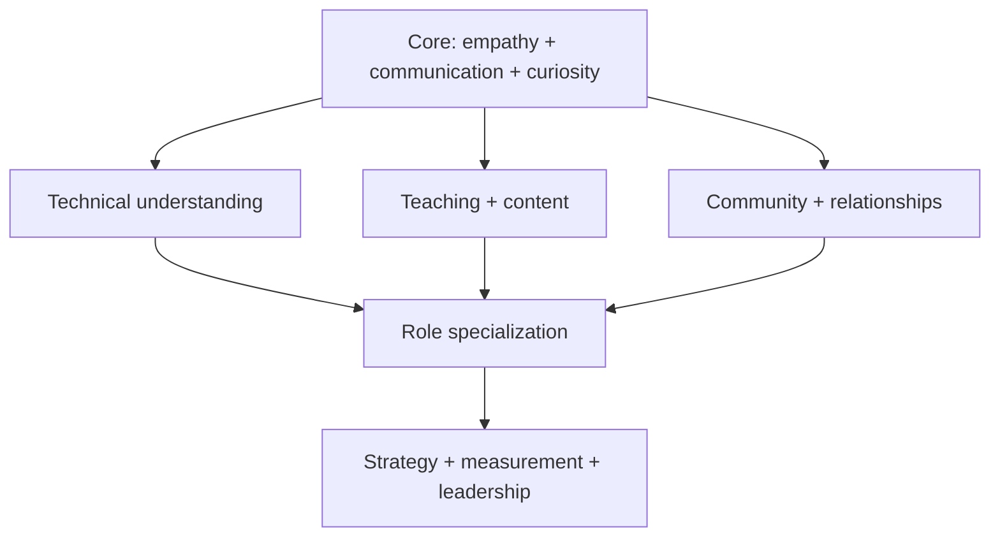

DevRel is one of those jobs where the tool list can get long very quickly.

You might write code in the morning, review documentation before lunch, record a product demo in the afternoon, answer community questions, prepare a talk, and then turn developer feedback into something Product can act on.

So the useful question is not:

> **What tools should every Developer Advocate use?**

It is:

> **What job am I trying to do, and what skill does that job require?**

Tools change. The underlying skills last much longer.

## Start with the skill, then choose the tool

A strong DevRel practitioner usually combines several kinds of work:

| Skill area | What it looks like in practice |
| --- | --- |
| Technical fluency | Build examples, debug integrations, read APIs/SDKs, understand developer workflows |
| Teaching | Explain unfamiliar ideas, design tutorials, run workshops, answer questions |
| Writing | Create docs, tutorials, launch content, proposals, reports, and feedback |
| Speaking | Give talks, demos, webinars, workshops, and internal presentations |
| Community | Listen, moderate, connect people, design programs, handle feedback |
| Developer experience | Find friction in onboarding, docs, APIs, tooling, errors, and support |
| Research | Understand the audience, ecosystem, competitors, questions, and product context |
| Measurement | Define useful outcomes, track signals, combine numbers with developer evidence |
| Internal influence | Bring developer evidence to Product, Engineering, Marketing, Sales, and leadership |
| Program management | Plan campaigns, events, content, contributors, budgets, and follow-up |

You do not need to be equally strong in all of them.

Different DevRel roles weight them differently.

## The technical baseline depends on the role

“DevRel” is an umbrella, not one job description.

A Developer Advocate for an infrastructure API may need to build production-like sample apps, debug auth flows, understand networking, and talk through architecture trade-offs.

A Developer Community Manager may need enough technical context to understand community conversations and route issues well, but spend much more time on programs, moderation, events, and community health.

A Technical Writer may go deeper on information architecture, API references, testing documentation, and editorial systems.

A Developer Experience Engineer may spend most of the week in code, SDKs, CLIs, starter templates, and onboarding flows.

So avoid the idea that there is one universal “DevRel stack.”

## A useful skills map



### 1. Core skills

These matter almost everywhere:

- listening;
- clear communication;
- curiosity;
- empathy without overpromising;
- follow-through;
- comfort learning in public;
- good judgment;
- the ability to explain what you know and admit what you do not.

### 2. Technical understanding

Depending on the role:

- programming fundamentals;
- APIs and HTTP;
- Git and GitHub;
- command-line tools;
- debugging;
- cloud or infrastructure concepts;
- the product's SDKs;
- data formats such as JSON and YAML;
- authentication;
- testing;
- basic system architecture.

The goal is not to know every technology.

The goal is to understand the developer's work well enough to help them succeed.

### 3. Communication and education

This includes:

- technical writing;
- documentation;
- public speaking;
- live demos;
- workshop design;
- storytelling;
- visual explanation;
- video;
- editing;
- curriculum design;
- adapting the same idea for beginners, practitioners, and leaders.

### 4. Strategy and organizational influence

As your scope grows, so does the need to:

- connect DevRel work to company goals;
- prioritize limited time;
- measure outcomes;
- report to leadership;
- influence roadmaps;
- build cross-functional relationships;
- design programs other people can run;
- decide what not to do.

## Choose tools by job to be done

A practical stack can be grouped like this.

### Research and knowledge work

**Claude** can help with first-pass research, synthesis, drafting, comparison, and working through large amounts of material. Use it as an assistant, not as evidence. Verify product behavior, code, quotes, dates, and claims before publishing.

**Recall** is useful when your problem is not generating another answer but keeping track of what you have already learned. It can save and summarize articles, videos, PDFs, and notes, connect them in a personal knowledge base, and let you search or chat across that material.

For DevRel, that can be useful for:

- conference research;
- competitor/product research;
- saving developer interviews;
- organizing useful talks;
- building a reference library for a technical domain;
- revisiting material before a workshop or article.

### Writing and documentation

Useful categories include:

- **GitHub** for source control, issues, pull requests, reviews, and contributor workflows;
- **Mintlify** for developer documentation with interactive references, search, and content workflows;
- **Docusaurus** when you want an open-source documentation framework and more frontend control;
- Markdown/MDX editors for authoring;
- Mermaid for diagrams that can live beside the documentation source;
- OpenAPI tooling for API references.

The tool is less important than the workflow:

```text
Issue / developer need
        ↓
Draft
        ↓
Technical review
        ↓
Editorial review
        ↓
Preview
        ↓
Merge
        ↓
Publish
        ↓
Feedback + maintenance
```

### Visual communication

**Canva** can be useful for:

- presentation slides;
- event graphics;
- social cards;
- simple diagrams;
- workshop handouts;
- branded templates;
- video presentations.

Do not use a visual tool just to make a page busier. Use visuals when they reduce the amount of explanation the reader has to hold in their head.

### Video and demos

Different tools fit different stages:

- **OBS Studio** for flexible screen recording, streaming, scenes, and live production;
- **Descript** for transcript-based video editing, captions, screen recording, and repurposing;
- built-in screen recording tools for fast product walkthroughs;
- presentation software for narrated demos;
- a simple phone camera when the story matters more than production complexity.

A clear five-minute demo beats a polished fifteen-minute demo that never gets to the point.

### Community and events

Your community stack might include:

- Discord or Slack;
- GitHub Discussions;
- Luma or another registration platform;
- forms and surveys;
- an event platform;
- a CRM or community-intelligence tool when scale justifies it.

The skill to protect here is **listening**. A community tool that produces more notifications but less understanding is not an upgrade.

### Measurement and reporting

Common building blocks include:

- product analytics;
- web analytics;
- community analytics;
- spreadsheets;
- dashboards;
- CRM data;
- survey tools;
- support data;
- a written monthly or quarterly report.

Do not start with the dashboard. Start with the question the dashboard should answer.

## An AI tool does not remove the need to know the work

AI can make a good practitioner faster.

It can also make an inexperienced practitioner produce confident mistakes faster.

For DevRel work, keep a simple rule:

> **Use AI to compress repetitive work. Do not use it to skip firsthand understanding.**

If you are writing a tutorial, run it.

If you are summarizing developer feedback, inspect the original conversations.

If you are making a product claim, check the product.

If you are preparing a talk, understand the examples well enough to explain them when the slides disappear.

## Build a small default stack

A useful personal stack should make the common work easy without giving you ten ways to do the same thing.

| Job | Default tool | Why |
| --- | --- | --- |
| Source and review | GitHub | One place for changes, discussion, history |
| Documentation | Mintlify or Docusaurus | Choose based on hosting/control needs |
| Research library | Recall | Keep useful source material findable |
| AI assistance | Claude | Research, synthesis, first drafts, analysis |
| Slides and simple visuals | Canva | Fast, collaborative visual production |
| Recording | OBS or native recorder | Reliable capture |
| Editing | Descript | Text-led editing and repurposing |
| Diagrams | Mermaid | Versionable diagrams close to the docs |
| Planning | Your team's existing tracker | Avoid adding a second project-management system |

This is an example, not a requirement.

## Evaluate a new tool before adding it

Ask five questions:

1. **What problem does this solve that we have repeatedly?**
2. **What tool or manual process does it replace?**
3. **Can the whole team use it, or will one person become the bottleneck?**
4. **What happens to our data, sources, recordings, or community information?**
5. **Will we still want this workflow six months from now?**

The best tool stack is usually smaller than the list of tools you have tried.

## Practice matters more than collecting software

If you want to grow in DevRel, spend more time producing evidence than configuring tools.

Write the tutorial.

Build the sample.

Give the five-minute talk.

Run the workshop.

Review the docs.

Answer the developer's question.

Analyze the feedback.

Then look at what slowed you down and choose a tool deliberately.

## Skills and tools checklist

- [ ] I know which DevRel role or workstream I am optimizing for.
- [ ] I can explain the developer problem before naming the tool.
- [ ] My technical depth matches the audience and product I support.
- [ ] I have a repeatable writing and review workflow.
- [ ] I can create a simple demo without depending on a large production stack.
- [ ] I know how community feedback reaches internal teams.
- [ ] I know which metrics matter for the work I own.
- [ ] AI-assisted work is verified before publication.
- [ ] Our team has one default tool for each common job where possible.
- [ ] We periodically remove tools that no longer earn their place.

## Further reading

- [DeveloperRelations.com: The four pillars of developer relations](https://developerrelations.com/guides/the-four-pillars-of-developer-relations/)
- [DeveloperRelations.com: Do you need to be a developer to work in DevRel?](https://developerrelations.com/guides/do-you-need-to-be-a-developer-to-work-in-dev-rel/)
- [GitHub Docs: Pull request reviews](https://docs.github.com/en/pull-requests/reference/pull-request-reviews)
- [Mintlify: Developer documentation](https://www.mintlify.com/use-cases/developer-documentation)
- [Docusaurus: Docs introduction](https://docusaurus.io/docs/docs-introduction)
- [Recall](https://www.recall.it/about)
- [Canva Help: Editing and designing](https://www.canva.com/help/editing-designing/)
- [OBS Knowledge Base](https://obsproject.com/kb)
- [Descript](https://www.descript.com/)
