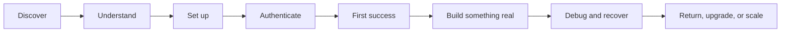
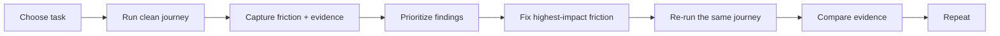

A developer experience audit is simple in principle: try to use the product the way a developer would, notice where the experience gets harder than it should, and collect enough evidence to fix it.

The hard part is doing that without relying on memory, assumptions, or a dashboard full of numbers that never tells you what actually went wrong.

A useful DX audit follows the journey.

It asks questions like:

- Can a developer find the right starting point?
- Can they understand what the product does before they invest time in setup?
- Can they install the SDK, CLI, IDE extension, or local tooling without hidden assumptions?
- Can they reach a first useful result?
- When something fails, does the error help them recover?
- Can they find a relevant example when the happy path is no longer enough?
- Can they get help without repeating everything they already tried?

The goal is not to give the product a pretty score.

The goal is to make friction visible enough that a team can remove it.

## Start with one real developer task

Do not begin an audit with “review the developer experience.” That scope is too broad to produce useful findings.

Start with a task.

For example:

- create an account and make the first API request;
- install an SDK and authenticate;
- run a sample application locally;
- add one feature to an existing project;
- configure a webhook;
- install an IDE extension and complete a coding task;
- migrate from one API or SDK version to another;
- find and fix a common integration error.

A good audit can usually be written as one sentence:

> A developer who has not used this product before should be able to go from the homepage to a successful API request in under 15 minutes without asking another person for help.

The exact target will vary. What matters is that everyone agrees on the task and what “success” means before the audit starts.

## Map the journey before you score anything

A developer journey is a sequence of moments, not a single page.



A documentation page may be excellent while the authentication flow is confusing. The SDK may feel good once installed while the installation instructions fail on a clean machine. Support may be fast while the error messages force developers to ask for help in the first place.

That is why an audit should follow the whole task, not grade isolated surfaces.

## Who are you auditing for?

The same product can feel completely different to different developers.

Before you begin, write down the persona you are testing for:

| Question | Example |
| --- | --- |
| Who are they? | Backend developer evaluating a new API |
| What do they already know? | Comfortable with REST and Node.js |
| What do they not know? | This product, its terminology, or account model |
| What are they trying to do? | Send a first request and parse the response |
| What environment are they using? | macOS, VS Code, Node 22 |
| What constraint matters? | They should not need a sales call or internal knowledge |

Do not create ten personas for one audit. Pick the one that matters for the question you are trying to answer.

## Run the audit from a clean starting point

Familiarity hides friction.

If you helped build the product, you already know which page to open, which environment variable is required, what an unclear error means, and which undocumented workaround everybody on the team uses.

A new developer knows none of that.

When possible:

- use a fresh browser profile;
- start from the public homepage or repository;
- use a clean project or container;
- avoid internal bookmarks and private documentation;
- do not ask a teammate unless the journey itself tells you to;
- record every workaround you needed.

If the auditor already knows the product well, bring in someone less familiar or explicitly document where prior knowledge may have affected the result.

## Keep a friction log

The friction log is the most useful artifact in a DX audit.

Record what happened while it is happening. Do not try to reconstruct the journey from memory at the end.

| Step | Expected | What happened | Evidence | Friction | Severity |
| --- | --- | --- | --- | --- | --- |
| Find quickstart | One obvious starting point | Two competing “Get started” pages | URLs + screenshot | Decision friction | Medium |
| Install SDK | One copyable command | Required runtime version is not mentioned | terminal output | Setup friction | High |
| Authenticate | API key location is obvious | Key exists but the docs use a different label | screenshot | Terminology friction | Medium |
| Run sample | Example works as written | Sample uses a deprecated method | error output | Technical friction | High |
| Recover | Error points to the fix | Error only says `401 Unauthorized` | terminal output | Recovery friction | High |

Evidence matters because “this felt confusing” is easy to dismiss. A failed command, timestamp, screenshot, broken link, support thread, or repeated community question gives the team something concrete to work with.

## What should a tooling DX audit examine?

The dimensions depend on the product, but the following set works well for APIs, SDKs, CLIs, developer platforms, IDE tools, and documentation-heavy products.

### 1. Discovery and positioning

Can the developer quickly answer:

- What is this?
- Who is it for?
- What problem does it solve?
- Where do I start?

If a developer has to read five marketing pages before finding the docs, that is friction too.

### 2. Getting started

Test the first-run path exactly as written.

Look for:

- prerequisites;
- install commands;
- supported runtime versions;
- environment variables;
- account or workspace requirements;
- copyable code;
- expected output;
- a clear definition of success.

This is where **time to first success** becomes useful. Measure from the moment the developer begins the setup flow to the moment they get the first meaningful result.

Do not optimize only for the stopwatch. A three-minute setup that leaves the developer with no idea what happened is not automatically better than a five-minute setup that builds a useful mental model.

### 3. Authentication and access

Authentication creates a surprising amount of avoidable friction.

Check:

- whether the developer knows which credential they need;
- whether it is easy to create and find;
- whether documentation and UI use the same names;
- whether permissions are understandable;
- whether secret-handling guidance is safe;
- whether expired, missing, or under-scoped credentials produce useful errors.

### 4. API, SDK, CLI, or IDE ergonomics

Once setup is complete, does the tool behave the way a developer would reasonably expect?

Look at:

- naming;
- defaults;
- discoverability;
- type information;
- autocomplete;
- command help;
- response shapes;
- consistency between languages or SDKs;
- how much boilerplate is required for a basic task.

The question is not “is the API technically correct?” It is “how much unnecessary thinking does the API make the developer do?”

### 5. Documentation and examples

Check whether the documentation supports both the happy path and the moment immediately after it.

A useful audit asks:

- Is search effective?
- Does navigation match the way developers think about tasks?
- Are examples current?
- Are code samples runnable?
- Do pages explain prerequisites?
- Are conceptual explanations available when copy-paste stops being enough?
- Can a developer move naturally from a quickstart to production concerns?

### 6. Errors and recovery

A tool is not only its successful path.

Force a few realistic mistakes:

- use a bad token;
- omit a required value;
- use the wrong runtime version;
- send an invalid request;
- trigger a common permissions issue;
- break a configuration value.

Then ask: does the product help the developer recover?

A good error should usually tell the developer what failed, where the failure happened, and what they can try next.

### 7. Feedback loops and speed

Developers spend a lot of time waiting for systems to tell them whether something worked.

Measure delays that interrupt flow:

- install time;
- local startup time;
- build time;
- test feedback;
- CI feedback;
- deployment feedback;
- API response during development;
- indexing or analysis time for developer tools.

Developer-experience research commonly frames effective DevEx around **feedback loops, cognitive load, and flow state**. A slow or unclear feedback loop can be as frustrating as a broken feature.

### 8. Support and community

When self-service fails, how easy is it to get help?

Check:

- where the support path lives;
- whether the developer knows which channel to use;
- whether they have to repeat account and environment details;
- response quality, not just response speed;
- whether repeated support questions become documentation or product improvements.

Support tickets and community questions are also audit evidence. Ten people asking the same setup question is a product signal.

### 9. Maintenance and change

The first experience is only part of developer experience.

Also inspect:

- versioning;
- changelogs;
- deprecation notices;
- migration guides;
- upgrade paths;
- backward compatibility;
- whether old examples remain discoverable after they stop working.

A product can have an excellent onboarding flow and still create painful DX every time it ships a breaking change.

### 10. Agent experience

AI coding agents are now another consumer of developer tooling and documentation.

That does not mean creating a separate product for agents. It means checking whether the same things that help humans also make the product machine-readable and executable:

- clear setup instructions;
- deterministic commands;
- explicit prerequisites;
- structured examples;
- useful error messages;
- current documentation;
- repository guidance such as `AGENTS.md`, skills, or other project instructions where appropriate.

An agent that repeatedly retries an undocumented setup step is surfacing a form of DX friction too.

## Use both observed and reported evidence

No single data source gives you the full picture.

A strong audit combines what developers **do** with what developers **say**.

| Evidence type | Examples | Useful for |
| --- | --- | --- |
| Task observation | screen recording, terminal trace, timestamps | Seeing the actual journey |
| Product telemetry | activation, failed requests, drop-off, SDK use | Finding patterns at scale |
| Support/community | tickets, Discord questions, GitHub issues | Discovering repeated friction |
| Interviews | developer walkthroughs, follow-up questions | Understanding why something felt difficult |
| Surveys | ease ratings, confidence, perceived friction | Comparing patterns across a larger group |
| Repository/docs evidence | broken commands, stale examples, missing env docs | Verifying concrete problems |

GitHub's research on developer productivity has used both qualitative and quantitative evidence rather than relying on telemetry alone. That is a good principle for DX audits too: system data can show where something happens, while first-hand developer feedback often helps explain why.

## A simple scoring system

Scores can help prioritize, but avoid fake precision.

For each dimension, use a small scale:

| Score | Meaning |
| ---: | --- |
| 0 | Blocked: the developer cannot reasonably complete the task |
| 1 | High friction: success requires guessing, searching, or undocumented workarounds |
| 2 | Moderate friction: the task works, but there are avoidable delays or confusing moments |
| 3 | Low friction: the path is clear, recoverable, and mostly self-service |

Always attach evidence to the score.

A `1` with three failed commands and a screenshot is useful. A `7.4/10` with no explanation is not.

## Prioritize findings by developer impact

An audit is not finished when you have a list of problems.

Turn findings into a repair queue.

A simple prioritization model is:

```text
Priority = severity × frequency × reach
```

Then add effort as a planning constraint.

For each finding, capture:

- **Problem:** what created friction?
- **Evidence:** how do we know?
- **Who it affects:** which developer/persona?
- **Frequency:** how often does it happen?
- **Impact:** what does it prevent or delay?
- **Fix:** what should change?
- **Owner:** which team can change it?
- **Verification:** how will we know the fix worked?

Do not automatically prioritize the easiest fixes. A one-line typo may be cheap, but a broken authentication flow may be costing far more developer time.

## Re-run the journey after the fix

The strongest DX audit has a before and an after.



If the original problem was “the quickstart fails because the required runtime version is missing,” do not close the issue when the docs PR merges.

Open a clean environment and run the quickstart again.

That final verification is what turns documentation work into an actual developer-experience improvement.

## Example: auditing an AI coding tool

Joy Ndukwe's short [Zencoder walkthrough](https://www.youtube.com/watch?v=m5v8K1LrUmI) gives us a real journey to examine. She starts with a familiar problem: spending too long debugging a Python script because of a small syntax mistake.

<ToolLink name="Zencoder" href="https://zencoder.ai/" logo="/images/tools/zencoder.png" />

<LegacyView src="https://www.youtube.com/embed/m5v8K1LrUmI" title="Joy Ndukwe's Zencoder walkthrough" height="420" />

The walkthrough shows this path:

1. Joy begins with the extension already installed and points viewers to Zencoder's setup guide.
2. She opens a Python file containing a small error.
3. She creates a chat and asks Zencoder to analyze the code.
4. Zencoder identifies the file and the error, then asks whether she wants it fixed.
5. Joy approves the fix and applies the generated change.

This is useful DX evidence because it exposes the full interaction around the successful result. Discovery and installation happen outside the demonstration, while context detection, diagnosis, approval, and applying the change happen inside the IDE workflow.

The video also gives us questions for a deeper audit:

- How clear is installation for somebody who has not already completed it?
- How long does repository indexing take on a larger project?
- Can the developer see which files and context the agent is using?
- What happens when the first diagnosis is wrong?
- Is the generated change easy to review before applying it?
- Does the workflow help the developer verify the fix with tests?

The walkthrough proves the small debugging path shown in the video. It does not establish performance on large repositories, difficult errors, or team workflows, so those remain separate audit tasks.

Its current product describes IDE integrations for VS Code and JetBrains, repository indexing, multi-file operations, workflow-based coding agents, verification, and team analytics.

A practical audit task could be:

> A developer should be able to install the IDE extension, open an unfamiliar repository, ask the agent to explain one feature, make a small change, and verify the result without leaving the documented workflow.

The friction log could examine:

1. finding the correct extension;
2. installation and sign-in;
3. repository indexing time and visibility;
4. how clearly the product explains what context it has;
5. the first useful prompt or task;
6. review and approval of generated changes;
7. test or verification feedback;
8. error recovery;
9. permissions and security expectations;
10. whether the documentation explains the limits of the workflow.

Joy's walkthrough is now linked and embedded from the original public YouTube upload. A future audit can add timed observations for installation, recovery, and verification without re-uploading the video.

## Example: auditing this Developer Relations guide

We can use this guide itself as a live DX audit.

The developer task is different because the product is documentation rather than an SDK:

> A person exploring Developer Relations should be able to find the right section, understand the concept, get a practical next step, and discover related material without getting lost in the navigation.

Our current documentation update already surfaced several kinds of friction:

- some pages existed but had little or no useful content;
- similar pages did not always have the same depth or structure;
- contributor knowledge existed outside the documentation and had not been integrated;
- the guide used emoji decoration where a consistent icon system would be clearer;
- examples and case studies needed stronger evidence and context;
- the content needed one editorial voice even though multiple people contribute;
- publishing across Mintlify and Thally should not create two competing sources of truth.

Those are DX findings.

The work we are doing now is the remediation plan: establish one content standard, verify links and examples, use a shared MDX source, improve navigation and visual consistency, and review all 21 audit pages systematically.

That also gives us a chance to re-audit the experience after the update instead of assuming that “more content” automatically means “better documentation.”

## A reusable DX audit template

Copy this when you audit a product, API, SDK, CLI, IDE tool, or documentation site.

### Audit brief

**Product:**
**Developer persona:**
**Task:**
**Starting point:**
**Success condition:**
**Environment:**
**Known constraints:**
**Date/version:**

### Journey timings

**Start:**
**First successful setup:**
**First meaningful result:**
**First error:**
**Recovery time:**
**Task completed:**

### Friction log

| Step | Expected | Actual | Evidence | Severity | Proposed fix |
| --- | --- | --- | --- | --- | --- |
| | | | | | |

### Scorecard

| Dimension | 0 to 3 | Evidence |
| --- | ---: | --- |
| Discovery | | |
| Getting started | | |
| Authentication | | |
| Tool/API ergonomics | | |
| Documentation | | |
| Error recovery | | |
| Feedback speed | | |
| Support/community | | |
| Maintenance/upgrade | | |
| Agent experience, if relevant | | |

### Prioritized actions

| Priority | Finding | Owner | Fix | Verification |
| ---: | --- | --- | --- | --- |
| 1 | | | | |
| 2 | | | | |
| 3 | | | | |

## DX audit checklist

Before the audit:

- [ ] Define one developer persona.
- [ ] Define one real task.
- [ ] Define what success looks like.
- [ ] Record product, SDK, API, docs, and runtime versions.
- [ ] Prepare a clean environment where possible.

During the audit:

- [ ] Start from the same place a developer would.
- [ ] Record timings instead of guessing later.
- [ ] Capture errors, screenshots, commands, and URLs.
- [ ] Keep a friction log.
- [ ] Test recovery, not only the happy path.
- [ ] Separate observed evidence from assumptions.

After the audit:

- [ ] Group related friction into root causes.
- [ ] Prioritize by severity, frequency, and reach.
- [ ] Give each important finding an owner.
- [ ] Define how the fix will be verified.
- [ ] Re-run the same task after changes ship.
- [ ] Feed repeated findings into docs, product, engineering, support, and community work.

## Further reading

- [State of Developer Relations 2024: Developer Experience](https://www.stateofdeveloperrelations.com/2024devrelreport): includes data on how frequently DevRel programs conduct DX and friction audits.
- [GitHub: Good DevEx increases productivity](https://github.blog/news-insights/research/good-devex-increases-productivity/): research on feedback loops, cognitive load, flow state, and developer outcomes.
- [GitHub: Quantifying Copilot's impact on developer productivity and happiness](https://github.blog/news-insights/research/research-quantifying-github-copilots-impact-on-developer-productivity-and-happiness/): a useful example of combining developer-reported and observed evidence.
- [DX Core 4](https://getdx.com/dx-core-4/): a broader engineering productivity framework combining speed, effectiveness, quality, and impact.
- [Zencoder IDE Agent](https://zencoder.ai/product/coding-agent): current product information for the Zencoder example used in this page.

## Related pages

- [Documentation Best Practices](/documentation-best-practices)
- [Feedback Collection](/feedback-collection)
- [Reporting to Leadership](/reporting-to-leadership)
